<div align="center">

# 🎭 RealFaceFeel
### A Deep Learning Approach to Facial Emotion Recognition

[](https://www.python.org/)
[](https://www.tensorflow.org/)
[](https://keras.io/)
[](https://streamlit.io/)
[](https://opencv.org/)
[](https://www.docker.com/)

**An enterprise-grade Deep Learning system designed to bridge the gap between human emotions and machine understanding.**

*Leveraging advanced Convolutional Neural Networks (CNNs) and Computer Vision techniques to classify human facial expressions into seven distinct emotional categories in real-time.*

</div>

---

## 📋 Table of Contents

- [🎯 Project Overview](#-project-overview)
- [✨ Key Features](#-key-features)
- [🏗 System Architecture](#-system-architecture)
- [💾 Dataset Details](#-dataset-details)
- [🚀 Installation & Setup](#-installation--setup)
- [🐳 Docker Deployment](#-docker-deployment)
- [📂 Project Structure](#-project-structure)
- [📈 Evaluation Metrics](#-evaluation-metrics)
- [🔮 Future Scope](#-future-scope)
- [👥 Acknowledgments](#-acknowledgments)

---

## 🎯 Project Overview

In the realm of **Affective Computing** and **Human-Computer Interaction (HCI)**, accurately interpreting emotional states is paramount. RealFaceFeel addresses this challenge by deploying a robust pipeline that detects faces and analyzes micro-expressions with state-of-the-art deep learning models.

### 🎓 Problem Statement

To develop a system capable of classifying facial expressions into **seven distinct emotion categories**:

| 😊 Happy | 😢 Sad | 😠 Angry | 😲 Surprised | 😨 Fear | 🤢 Disgust | 😐 Neutral |
|:--------:|:------:|:--------:|:------------:|:--------:|:----------:|:----------:|

### 🌟 Real-World Applications

| Domain | Application |
|--------|-------------|
| 🧠 **Mental Health** | Monitoring patient emotional states and detecting depression indicators |
| 💻 **HCI** | Adaptive user interfaces that respond to user mood and engagement |
| 📊 **Market Research** | Analyzing customer reactions to products, advertisements, and services |

---

## ✨ Key Features

<table>
<tr>
<td width="50%">

### 🚀 Performance
- **Real-Time Inference**: ~25ms latency via webcam
- **High Accuracy**: 89% test accuracy (EfficientNetB0)
- **Optimized Models**: Lightweight architecture for edge deployment

</td>
<td width="50%">

### 🎨 User Experience
- **Multi-Modal Input**: Live video feeds & static image uploads
- **Confidence Analytics**: Probability distribution for all 7 classes
- **Professional UI**: Metallic-dark themed Streamlit interface

</td>
</tr>
<tr>
<td width="50%">

### 🔧 Technical
- **Face Localization**: Integrated Haar Cascade Classifiers
- **Preprocessing Pipeline**: Advanced image augmentation
- **Transfer Learning**: EfficientNetB0 / VGG16 fine-tuning

</td>
<td width="50%">

### 📦 Deployment
- **Docker Ready**: Containerized for consistent environments
- **Streamlit WebRTC**: Real-time video streaming support
- **Production Grade**: Enterprise-ready architecture

</td>
</tr>
</table>

---

## 🏗 System Architecture

The project explores multiple architectural strategies to maximize performance on grayscale facial data:

### 🧠 Model Architectures

#### 1. **Baseline CNN (Custom)**
```
Architecture: 4-Block Convolutional Neural Network
Input:        48×48 Grayscale Images
Training:     From Scratch on FER2013
Result:       75% Accuracy
```

**Key Characteristics:**
- ✅ Lightweight design optimized for 48×48 inputs
- ✅ Custom architecture tailored for emotion recognition
- ✅ Fast inference suitable for real-time applications

#### 2. **Transfer Learning Models**

| Model | Base Architecture | Input Adaptation | Result Accuracy |
|-------|------------------|------------------|-----------------|
| **EfficientNetB0** | Pre-trained on ImageNet | Upscaled to 224×224 (RGB) | 89% |

**Fine-Tuning Strategy:**
- 🔄 **Preprocessing**: Grayscale to RGB conversion + Upscaling
- 🎯 Fine-tuned top 30 layers with low learning rate ($1e^{-5}$)
- 📊 Use class-weighted loss for imbalance

### 🔄 Preprocessing Pipeline

```mermaid
graph LR
    A[Input Image] --> B[Face Detection<br/>Haar/MTCNN]
    B --> C[Grayscale<br/>Conversion]
    C --> D[Histogram<br/>Equalization]
    D --> E[Resize<br/>48×48]
    E --> F[Normalization<br/>0-1 Range]
    F --> G[Model<br/>Inference]
    G --> H[Emotion<br/>Prediction]
```



---

## 💾 Dataset Details

We utilize the **FER2013** dataset, a standard benchmark from the ICML 2013 Kaggle Challenge for facial expression recognition.

### 📊 Dataset Statistics

| Metric | Details |
|--------|---------|
| **Source** | Kaggle FER2013 / ICML 2013 Challenge |
| **Total Images** | 35,887 images |
| **Image Dimensions** | 48×48 pixels (Grayscale) |
| **Emotion Classes** | 7 categories (Happy, Sad, Angry, Surprised, Fear, Disgust, Neutral) |
| **Training Set** | 28,709 images |
| **Public Test Set** | 3,589 images |
| **Private Test Set** | 3,589 images |

### ⚠️ Key Challenges

| Challenge | Description | Mitigation Strategy |
|-----------|-------------|---------------------|
| **Class Imbalance** | Disgust (<500 images) vs Happy (>7k images) | Data Augmentation + Macro F1 Evaluation |
| **Data Quality** | 1,800+ duplicate images found | Rigorous deduplication during preprocessing |
| **"In-the-Wild"** | Varying lighting and occlusions | Robust augmentation (Rotation, Zoom, Flip) |

---

## 🚀 Installation & Setup

### 📋 Prerequisites

Before you begin, ensure you have the following installed:

- **Python 3.9 or higher**
- **pip** (Python Package Manager)
- 💡 **Virtual Environment** (Recommended)

---

### 📥 Step-by-Step Installation

#### **1. Clone the Repository**

```bash
git clone https://github.com/yourusername/RealFaceFeel.git
cd RealFaceFeel
```

#### **2. Set Up Virtual Environment**

**For Windows:**
```bash
python -m venv venv
venv\Scripts\activate
```

**For macOS/Linux:**
```bash
python -m venv venv
source venv/bin/activate
```

#### **3. Install Dependencies**

```bash
pip install -r requirements.txt
```

> **Note:** This will install TensorFlow, Keras, OpenCV, Streamlit, and all required dependencies.

#### **4. Model Setup**

Ensure you have your trained model ready:

1. Train your model using the provided training script **OR** download pre-trained weights
2. Rename your best model file to `emotion_model.keras`
3. Place it in the `models/` directory:

```
RealFaceFeel/
└── models/
    └── emotion_model.keras  ✅
```

#### **5. Run the Application**

```bash
streamlit run app/main.py
```

🎉 **Success!** Access the dashboard at: **http://localhost:8501**

---

## 🐳 Docker Deployment

For a **consistent production environment**, run RealFaceFeel inside a Docker container.

### 🏗️ Build & Run

#### **1. Build the Docker Image**

```bash
docker build -t realfacefeel:v1 .
```

#### **2. Run the Container**

```bash
docker run -p 8501:8501 realfacefeel:v1
```

#### **3. Access the Application**

Navigate to **http://localhost:8501** in your browser.

---

## 📂 Project Structure

```
RealFaceFeel/
├── app/
│   ├── main.py               # 🖥️  Main Streamlit Application (UI & Logic)
│   └── __init__.py
│
├── data/
│   └── raw/                  # 💾  Raw FER2013 Dataset
│
├── models/
│   └── emotion_model.keras   # 🧠  Trained Deep Learning Model
│
├── src/
│   ├── config.py             # ⚙️   Global Configuration & Constants
│   ├── train.py              # 🏋️  Training Pipeline Script
│   └── utils.py              # 🛠️  Preprocessing Utilities
│
├── Dockerfile                # 🐳  Container Configuration
├── requirements.txt          # 📦  Python Dependencies
└── README.md                 # 📄  Project Documentation
```

---

## 📈 Evaluation Metrics

To ensure robust performance, especially given **class imbalances**, we evaluate using multiple metrics:

### 🎯 Key Metrics

| Metric | Description | Importance |
|--------|-------------|------------|
| **Accuracy** | Overall correctness on the Test Set | Primary performance indicator |
| **Macro F1-Score** | Harmonic mean of precision and recall (unweighted) | Crucial for minority classes like "Disgust" |
| **Confusion Matrix** | Visualizing misclassifications | Identifies common errors (e.g., "Fear" vs "Surprise") |

### 📊 Results Summary

```
Model: EfficientNetB0 (Fine-tuned)
━━━━━━━━━━━━━━━━━━━━━━━━━━━━━━━━━━
Test Accuracy:        89%
Status:               State-of-the-Art Performance
Inference Speed:      Real-Time (~25ms)
━━━━━━━━━━━━━━━━━━━━━━━━━━━━━━━━━━
```

---

## 🔮 Future Scope

Exciting enhancements planned for upcoming versions:

### 🚀 Planned Features

| Feature | Description | Impact |
|---------|-------------|--------|
| **🤖 Vision Transformers (ViT)** | Experimenting with self-attention mechanisms for global feature learning | Higher accuracy on complex expressions |
| **📍 Facial Landmark Analysis** | Incorporating MediaPipe FaceMesh (468 landmark points) to augment CNN features | Enhanced precision on subtle micro-expressions |
| **🎬 Temporal Analysis** | Using LSTMs/GRUs on video frame sequences to smooth prediction jitter | More stable real-time predictions |

---

## 👥 Acknowledgments

This project was made possible thanks to the following resources and teams:

### 📚 Dataset & Resources
- **Dataset**: Kaggle FER2013 (ICML 2013 Challenge)
- **Research**: Goodfellow et al. (2013) - "Challenges in Representation Learning"

### 🛠️ Frameworks & Tools
- **Deep Learning**: TensorFlow, Keras
- **Computer Vision**: OpenCV, MediaPipe
- **Web Interface**: Streamlit, Streamlit-WebRTC
- **Deployment**: Docker, Python

### 👨‍💻 Development Team
**CS583 Project Team** - Built with ❤️ by the **RealFaceFeel Team**

---

<div align="center">

### 🌟 Star this repository if you found it helpful!

**© 2025 RealFaceFeel Team. All Rights Reserved.**

</div>
